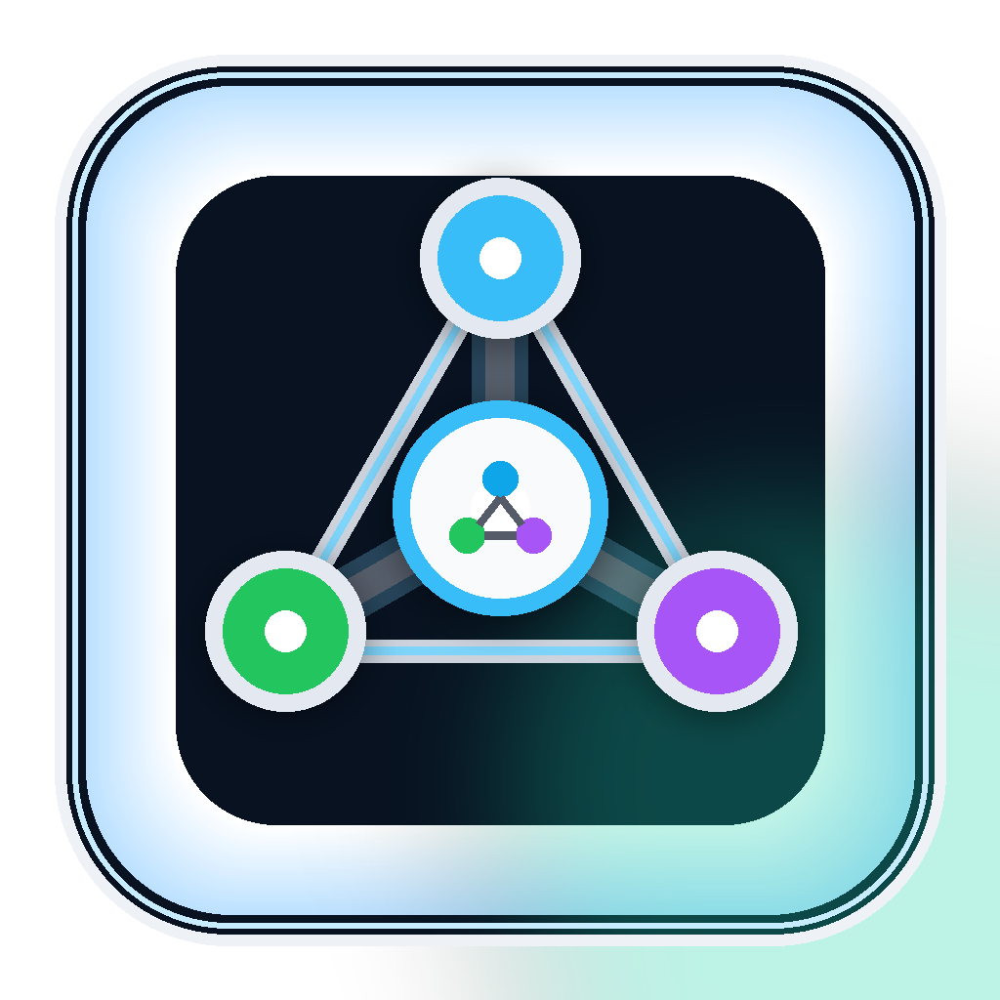

# AI Agent Swarm Codex-only

<p align="center">
  
</p>

<p align="center">
  <strong>Codex 主控、Codex 子智能体协作、本地 RAG 记忆库。</strong>
</p>

<p align="center">
  
  
  <a href="./LICENSE"></a>
</p>

AI Agent Swarm Codex-only 是 AI Agent Swarm 的纯 Codex 分支。它保留官方 Custom Agents、工程闸门和本地项目记忆库，但默认不暴露外部模型工具，也不要求任何外部模型 API key。

当前版本：`1.5.6-codex.1`。

适合你想要一个更干净、更可控的工作流时使用：

- Codex 做主控、最终决策和真实验证。
- Codex Custom Agents 负责编码、审查、测试策略、命令执行、安全审计和 RAG 候选整理。
- MCP 只提供本地状态和 RAG 工具。
- 本地 RAG 只存放 Codex 已验证的项目知识，不自动信任未验证内容。

## 快速开始

1. 安装插件。
2. 需要修改默认 RAG 目录时，复制 `.env.example` 为 `.env` 并只填写本地配置。
3. 日常任务直接发送 [docs/START_PROMPT.md](./docs/START_PROMPT.md) 的内容。

安装后建议先运行：

```powershell
node scripts/mcp-smoke-test.mjs
node scripts/rag-self-test.mjs
node scripts/codex-only-self-test.mjs
```

## 默认工具

Codex-only MCP server 只暴露这些工具：

| Tool | Purpose |
| --- | --- |
| `multi_model_config_status` | 查看 Codex-only 模式、暴露工具和 RAG 配置状态 |
| `multi_model_rag_status` | 查看本地 RAG 状态，不返回正文 |
| `multi_model_rag_ingest` | 导入 Codex 明确授权的本地文件 |
| `multi_model_rag_note` | 写入 Codex 已验证知识 |
| `multi_model_rag_search` | 本地词法检索 RAG |
| `multi_model_rag_get` | 按 chunk/document id 获取有限上下文 |

Codex-only 默认不提供外部模型编码、外部模型审查、外部测试分析或 custom provider 调用工具。

## Custom Agents

发布包包含这些 Codex Custom Agent 模板：

```text
.codex/agents/
  codex-coder.toml
  codex-reviewer.toml
  codex-tester.toml
  test-runner.toml
  rag-curator.toml
  security-auditor.toml
```

这些文件需要位于当前项目 `.codex/agents/` 或用户级 `~/.codex/agents/` 才会被 Codex 加载。子智能体完成后，主控必须关闭它们以释放并发槽位。

## 文档入口

用户通常只需要三个入口：

- [docs/INSTALL_PROMPT.md](./docs/INSTALL_PROMPT.md)：安装后验证。
- [docs/START_PROMPT.md](./docs/START_PROMPT.md)：日常开发、已有项目接手、新项目启动的统一入口。
- [docs/RELEASE_PROMPT.md](./docs/RELEASE_PROMPT.md)：发布前检查和 GitHub Release 同步。

补充文档：

- [docs/CUSTOM_AGENTS.md](./docs/CUSTOM_AGENTS.md)
- [docs/ENGINEERING_GATE.md](./docs/ENGINEERING_GATE.md)
- [docs/OFFICIAL_DOCS_GATE.md](./docs/OFFICIAL_DOCS_GATE.md)
- [docs/RAG.md](./docs/RAG.md)
- [docs/ROADMAP.md](./docs/ROADMAP.md)

## 工程闸门

非简单任务正式编码前，Codex 应先产出工程设计和开发计划，并让 `codex-reviewer` 做 plan-review。开发中维护 Progress Ledger；高风险 diff 交给 `codex-reviewer` 做 diff-review；真实命令由主控或 `test-runner` 执行，并记录 command、exit code、stdout、stderr。

模板：

- [templates/engineering-design.template.md](./templates/engineering-design.template.md)
- [templates/development-plan.template.md](./templates/development-plan.template.md)

## 本地 RAG

RAG 默认存放在稳定的 Codex 用户目录：

```text
$CODEX_HOME/multi-model-agents/rag
```

未设置 `CODEX_HOME` 时使用：

```text
~/.codex/multi-model-agents/rag
```

不要把 RAG 数据放进项目仓库、提交到 Git、打包进 release，或用于无关项目。

## 开发者

- 开发者：Su94
- 邮箱：601107432@qq.com
- 联系电话：17623311332
- GitHub：[su94-X/AI-Agent-Swarm](https://github.com/su94-X/AI-Agent-Swarm)

## License

This project is licensed under the Apache License 2.0. See [LICENSE](./LICENSE) for details.
