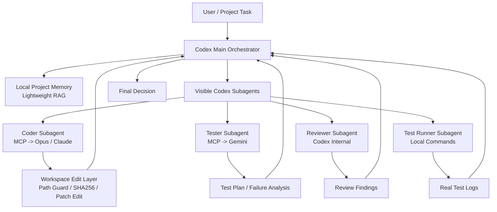

# AI Agent Swarm

<p align="center">
  
</p>

<p align="center">
  <strong>Codex 主控的多模型协作插件：Opus/Claude 主编码，Gemini 测试分析，Codex 内部审查，本地项目记忆库长期沉淀。</strong>
</p>

<p align="center">
  <a href="https://github.com/su94-X/AI-Agent-Swarm/releases/tag/v1.4.9"></a>
  <a href="./LICENSE"></a>
  
  
</p>

## 简介

AI Agent Swarm 是一个面向长期项目维护的本地 Codex 多模型编排插件。它的目标不是替换 Codex 主智能体，而是把外部模型能力纳入 Codex 可控的授权、审查、测试和记忆流程。

V1.4.9 是当前正式稳定版本。它保留三段式通用提示词、工程闸门、workspace 安全、RAG 质量层、MCP 可见日志、patch/edit 局部编辑和强制可见角色子智能体契约，并新增安全的 GitHub Release 同步脚本，支持从用户级凭据文件读取长期 token。

## 核心定位

| 角色 | 职责 |
| --- | --- |
| Codex Main Orchestrator | 规划、授权、审查、真实测试执行、RAG 写入、最终决策 |
| Opus/Claude Coder | 在 Codex 授权路径内执行主要编码实现 |
| Gemini Tester | 生成测试计划、边界用例和失败日志分析 |
| Codex Internal Reviewer | 默认负责代码审查，不额外调用外部 GPT reviewer |
| RAG Curator | 整理候选知识，最终由 Codex 写入本地项目记忆库 |
| Custom Role | 可选 OpenAI-compatible 外部模型角色 |

外部模型不会直接获得无限仓库权限，也不会直接写入项目记忆库。所有真实文件修改、命令执行、测试结果判定和最终接受决定仍由 Codex 完成。

## 工程闸门

非简单任务默认启用工程闸门：

1. Codex 先执行 Gate 0 预检，确认 MCP 工具、RAG、Coder、Tester 和必要 key 状态，不打印密钥。
2. Codex 产出工程设计文档和开发计划，包含目标、非目标、读写边界、data flow、prompt injection surface、credential handling、外部网络范围、风险、回退和验证路径。
3. 设计和计划交给 Opus/Claude 做 plan-review。只要有 blocking findings 或 must-fix items，Codex 必须先修文档和计划并复审。
4. 进入开发后，Codex 按批准计划自动推进；高风险或非平凡 diff 进入 diff-review。
5. 真实测试由 Codex/Test Runner 执行，并记录 command、exit code、stdout、stderr。测试证据交给 Gemini 做 test-review/failure analysis。

详见 [docs/ENGINEERING_GATE.md](./docs/ENGINEERING_GATE.md)。

## 架构



## 3 步快速开始

1. 下载并解压 [ai-agent-swarm-1.4.9.zip](https://github.com/su94-X/AI-Agent-Swarm/releases/download/v1.4.9/ai-agent-swarm-1.4.9.zip)。
2. 复制 `.env.example` 为 `.env`，只填写当前确实要用的外部模型 key。
3. 在 Codex 中发送 `docs/INSTALL_PROMPT.md` 做安装检查；日常开发发送 `docs/START_PROMPT.md`。

维护者发布版本时，发送：

```text
docs/RELEASE_PROMPT.md
```

## 功能亮点

- **Opus/Claude 主编码**：通过 `multi_model_coder_workspace_edit` 在授权路径内执行主要编码。
- **Patch/Edit 局部编辑**：支持 `replace`、`insert_after`、`insert_before`，并要求唯一匹配。
- **Workspace 安全边界**：路径校验、symlink 防逃逸、forbidden paths、`expected_sha256` 防旧上下文覆盖。
- **Gemini 测试分析**：输出测试计划、建议命令、边界用例和失败日志分析，但不伪装成真实测试执行。
- **Codex 内部审查**：默认 reviewer 为 `codex-internal`，避免重复消耗外部 GPT API。
- **本地项目记忆库**：JSONL + 词法检索，支持 `confidence`、`verified_by`、`expires_at`、`scope`、`aliases`、`status`。
- **可见角色子智能体**：Coder、Tester、Reviewer、Test Runner、RAG Curator 都可以在 Codex 中保留可见过程。
- **强制可见子智能体契约**：非简单任务若有 Codex 子智能体工具可用，必须先创建或复用角色子智能体；没有工具时必须明示降级。
- **无 npm 依赖**：MCP server、打包、zip 校验和自测均使用 Node 内置模块。
- **跨平台发布包**：`scripts/package-release.mjs` 统一生成 zip，并校验无 `.env`、无 RAG 数据、无反斜杠路径。
- **安全 Release 同步**：`scripts/sync-github-release.mjs` 可创建/更新 GitHub Release 并上传 zip asset，token 只从环境变量或用户级凭据文件读取。

## MCP 工具

| 工具 | 用途 |
| --- | --- |
| `multi_model_coder_patch` | 让 coder 模型给出 diff 或实现建议，不直接写文件 |
| `multi_model_coder_workspace_edit` | 让 coder 模型在授权路径内执行 workspace 编辑 |
| `multi_model_reviewer_findings` | 可选外部 reviewer；默认不使用 |
| `multi_model_tester_plan` | 让 Gemini 生成测试计划和失败日志分析 |
| `multi_model_role_call` | 调用 custom 外部模型角色 |
| `multi_model_config_status` | 查看 provider/model/baseUrl/apiKeyEnv/hasApiKey 状态，不打印 key |
| `multi_model_rag_status` | 查看本地项目记忆库状态 |
| `multi_model_rag_ingest` | 导入 Codex 明确授权读取的本地文件 |
| `multi_model_rag_note` | 写入 Codex 已验证的知识条目 |
| `multi_model_rag_search` | 本地词法检索，不调用外部模型 |
| `multi_model_rag_get` | 按 chunk/document id 获取有限上下文 |

## 默认角色配置

| 角色 | Provider | 默认模型 | API Key 环境变量 |
| --- | --- | --- | --- |
| Coder | `anthropic` | `claude-opus-4-8` | `ANTHROPIC_API_KEY` |
| Reviewer | `codex-internal` | `gpt-5.5` | 不需要 |
| Tester | `gemini` | `gemini-3.5-flash` | `GEMINI_API_KEY` |
| Custom | `openai-compatible` | 可配置 | `EXTERNAL_MODEL_API_KEY` |

如果你的账号、网关或任务需要其他模型，可通过 `.env` 中的 `MMA_*_MODEL` 变量覆盖。

## 配置

复制模板：

```powershell
Copy-Item .env.example .env
```

`*_API_KEY_ENV` 字段应填写环境变量名，不是密钥值本身：

```text
MMA_CODER_API_KEY_ENV=ANTHROPIC_API_KEY
ANTHROPIC_API_KEY=这里才是本地真实 key
```

RAG 可选配置：

```text
MMA_RAG_ROOT=
MMA_RAG_WRITE_ENABLED=true
MMA_RAG_MAX_RESULT_CHARS=4000
```

Gemini 默认用 `x-goog-api-key` header 传递 key，避免 key 出现在 URL query 中。如果某些 Gemini-compatible 网关只支持 query 参数，可以设置：

```text
MMA_GEMINI_API_KEY_IN_HEADER=false
```

## 何时不要启用外部模型

- 任务只是简单问答、纯解释、单条命令查询或很小的局部修改。
- 当前任务涉及 `.env`、API key、生产数据、私有日志、客户数据或无法裁剪的敏感上下文。
- 不能明确给出窄范围的 `allowed_read_paths` 和 `allowed_write_paths`。
- 网络/API 成本或合规边界不允许调用外部模型。
- 需要最终验收、真实测试结论或安全结论时，不应让外部模型直接做最终决定。

## 文档

| 文档 | 说明 |
| --- | --- |
| `docs/INSTALL_PROMPT.md` | 唯一安装检查入口：安装、结构、MCP 可见性和离线自检 |
| `docs/START_PROMPT.md` | 唯一日常启动入口：简单任务、新项目、已有项目、工程闸门和子智能体自动判断 |
| `docs/RELEASE_PROMPT.md` | 维护者发布入口：分支、tag、GitHub Release、zip asset 和页面核查 |
| `docs/ENGINEERING_GATE.md` | 工程闸门：plan-review、diff-review、test-review 和阻塞报告规则 |
| `docs/SUBAGENT_WORKFLOW.md` | 可见子智能体工作流和角色说明 |
| `docs/RAG.md` | 本地项目记忆库说明 |
| `docs/ROADMAP.md` | 后续路线图 |
| `docs/roles/` | 各可见角色子智能体的中文提示词 |

旧的 `PACKAGE_INSTALL_PROMPT.md`、`FIRST_INSTALL_PROMPT.md`、`STARTUP_PROMPT.md`、`PROJECT_START_PROMPT.md`、`SUBAGENT_START_PROMPT.md`、`EXISTING_PROJECT_HANDOFF_PROMPT.md`、`NEW_PROJECT_BOOTSTRAP_PROMPT.md` 仅作为兼容跳转保留，普通用户不需要再选择它们。

## 本地自检

```powershell
node scripts/mcp-smoke-test.mjs
node scripts/http-retry-self-test.mjs
node scripts/model-secret-self-test.mjs
node scripts/rag-self-test.mjs
node scripts/rag-metadata-self-test.mjs
node scripts/rag-security-self-test.mjs
node scripts/rag-text-self-test.mjs
node scripts/workspace-edit-json-self-test.mjs
node scripts/workspace-edit-repair-self-test.mjs
node scripts/tester-prompt-self-test.mjs
node scripts/subagent-prompt-self-test.mjs
```

这些离线自检不调用真实外部模型 API。真实连通性测试使用：

```powershell
node scripts/api-smoke-test.mjs
```

## 打包发布

正式发布包使用白名单打包脚本生成：

```powershell
node scripts/package-release.mjs C:\path\to\outputs
```

该脚本只打包 `.codex-plugin`、`.mcp.json`、`.env.example`、`README.md`、`LICENSE`、`NOTICE`、`CHANGELOG.md`、`CONTRIBUTING.md`、`SECURITY.md`、`docs/`、`skills/`、`scripts/`、`lib/` 和 `assets/`，并校验：

- 包内没有 `.env`
- 包内没有 RAG 数据目录
- zip entry 统一使用 `/`
- `plugin.json` 是 ASCII-only 可解析 JSON
- `.mcp.json` 使用相对 MCP 路径

GitHub Release 同步可以使用：

```powershell
node scripts/sync-github-release.mjs C:\path\to\outputs
```

认证顺序：

1. `GITHUB_TOKEN` 或 `GH_TOKEN` 环境变量。
2. `MMA_GITHUB_TOKEN_FILE` 指定的用户级 token 文件。
3. `$CODEX_HOME\multi-model-agents\github-release-token`，如果设置了 `CODEX_HOME`。
4. 默认用户级文件：`%USERPROFILE%\.codex\multi-model-agents\github-release-token`。
5. 兼容临时文件：`%TEMP%\github_release_token.txt`。

不要把 GitHub token 放进插件仓库、`.env`、README、发布包或聊天记录。`sync-github-release.mjs` 会拒绝读取插件仓库内的 token 文件，并在错误输出中脱敏常见 GitHub token 形态。长期维护建议使用 fine-grained token，只授权 `su94-X/AI-Agent-Swarm` 的 Contents/Metadata 读写权限。如果 token 曾经粘贴到聊天里，建议撤销并重新生成。

## 开源与贡献

- 变更记录：[CHANGELOG.md](./CHANGELOG.md)
- 安全策略：[SECURITY.md](./SECURITY.md)
- 贡献说明：[CONTRIBUTING.md](./CONTRIBUTING.md)
- Release：[AI Agent Swarm V1.4.9](https://github.com/su94-X/AI-Agent-Swarm/releases/tag/v1.4.9)

## 联系方式

- 开发者：Su94
- 邮箱：601107432@qq.com
- 联系电话：17623311332
- GitHub：[su94-X/AI-Agent-Swarm](https://github.com/su94-X/AI-Agent-Swarm)

## License

This project is licensed under the Apache License 2.0. See [LICENSE](./LICENSE) for details.
