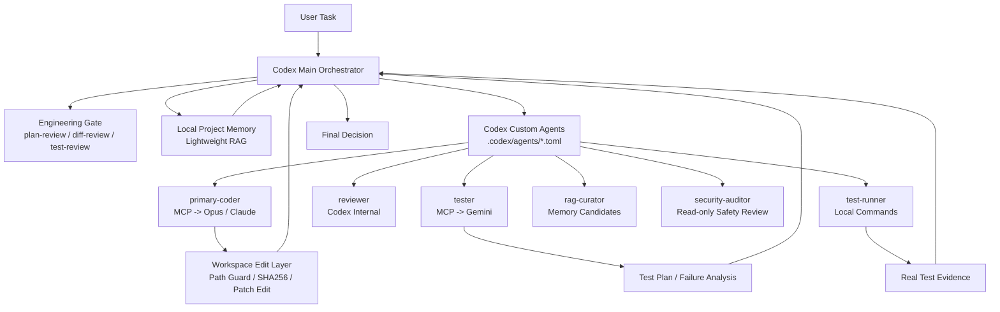

# AI Agent Swarm

<p align="center">
  
</p>

<p align="center">
  <strong>Codex 主控的多模型协作插件：让 Codex 编排 Opus/Claude、Gemini、本地项目记忆库和官方 Custom Agents。</strong>
</p>

<p align="center">
  <a href="https://github.com/su94-X/AI-Agent-Swarm/releases/tag/v1.5.3"></a>
  <a href="./LICENSE"></a>
  
  
</p>

## 这是什么

AI Agent Swarm 是一个本地 Codex 插件，用于长期项目维护中的多模型协作。

它不替代 Codex 主智能体，也不让外部模型无限接管仓库。它做的是把外部模型能力放进 Codex 可控的工程流程里：

- Codex 负责规划、授权、真实文件修改、真实测试、审查整合、RAG 写入和最终决策。
- Opus/Claude 负责主要编码实现，或在 Lite 版中负责审查与评分。
- Gemini 负责测试计划、边界用例和失败日志分析。
- 本地项目记忆库用于沉淀已验证的 bug、命令、决策、约定和风险。
- 官方 Custom Agents 模板让 Coder、Tester、Reviewer、Test Runner、RAG Curator、Security Auditor 成为可见的 Codex 子智能体角色。

V1.5.3 默认启用模型层流式调用，降低 Opus/Claude 或 Gemini 大上下文、长输出场景下的长时间无响应和网关空闲超时风险；如果某个网关不支持 SSE，可设置 `MMA_MODEL_STREAMING=false` 回退。它延续 V1.5.0 的核心能力：`.codex/agents/*.toml` 官方 Custom Agent 模板、工程闸门、workspace 安全边界、本地项目记忆库、MCP 可见日志、patch/edit 局部编辑和安全发布包，并保留 V1.5.2 强化的 Custom Agent 执行合同。

## 两个版本

| 版本 | 适合场景 | 外部模型角色 | Release |
| --- | --- | --- | --- |
| AI Agent Swarm | 完整多模型开发工作流 | Opus/Claude 主编码，Gemini 测试分析，Codex 内部审查 | [v1.5.3](https://github.com/su94-X/AI-Agent-Swarm/releases/tag/v1.5.3) |
| AI Agent Swarm Lite | 更短、更低成本的审查评分流程 | Codex 自己实现，Opus/Claude 做外部审查和评分，无 Gemini | [v1.5.0-lite.1](https://github.com/su94-X/AI-Agent-Swarm/releases/tag/v1.5.0-lite.1) |

如果你想让 Opus/Claude 负责主要编码，用完整版。
如果你只想让 Opus/Claude 做高质量审查和评分，用 Lite 分支。

## 核心原则

| 原则 | 说明 |
| --- | --- |
| Codex 是主控 | 只有 Codex 做最终决策、运行真实命令、写入 RAG、接受或拒绝结果。 |
| 外部模型有边界 | 只把必要文件、diff、日志和约束发给外部模型，不发送密钥或无关仓库内容。 |
| 写权限窄授权 | `multi_model_coder_workspace_edit` 必须传入 `allowed_read_paths` 和 `allowed_write_paths`。 |
| 角色不自执行 | `primary-coder` 必须调用 Opus/Claude MCP 工具，`tester` 必须调用 Gemini MCP 工具；子智能体不能自己代替外部模型执行这些角色。 |
| 默认流式调用 | `MMA_MODEL_STREAMING=true` 默认启用，server 聚合 SSE 后再返回 MCP 工具结果；网关不支持时可设为 `false`。 |
| 真实测试本地执行 | Gemini 可以建议测试，但不能声称测试已运行。 |
| RAG 只写已验证事实 | 未验证的 Opus/Gemini 输出不能直接写入 trusted RAG。 |
| 子智能体要关闭 | 子智能体完成后必须 `close_agent` 或等价关闭，释放并发槽位。 |

## 架构



## 快速开始

1. 下载发布包：[ai-agent-swarm-1.5.3.zip](https://github.com/su94-X/AI-Agent-Swarm/releases/download/v1.5.3/ai-agent-swarm-1.5.3.zip)
2. 复制 `.env.example` 为 `.env`，只填写你本地确实要用的外部模型 key。
3. 在新的 Codex 线程中发送：

```text
docs/INSTALL_PROMPT.md
```

4. 日常开发、新项目、已有项目接手，都发送：

```text
docs/START_PROMPT.md
```

5. 维护者打包和同步 GitHub Release 时，发送：

```text
docs/RELEASE_PROMPT.md
```

普通用户只需要记住这三个文档。旧版拆分提示词已经移动到 `docs/legacy/`。

## 启用 Custom Agents

V1.5.x 发布包内置官方 Codex Custom Agent 模板：

```text
.codex/agents/
  primary-coder.toml
  reviewer.toml
  tester.toml
  test-runner.toml
  rag-curator.toml
  security-auditor.toml
```

这些文件不是 Skill，也不是 MCP 工具。它们是 Codex 官方 Subagents / Custom Agents 配置模板。

Codex 只会从当前项目或用户级目录加载 Custom Agents：

```text
项目级：<你的项目>/.codex/agents/*.toml
用户级：~/.codex/agents/*.toml
Windows 用户级：C:\Users\<你的用户名>\.codex\agents\*.toml
```

如果你希望某个开发项目默认使用这些角色，把发布包里的 `.codex/agents/` 复制到项目根目录：

```powershell
New-Item -ItemType Directory -Force .\.codex
Copy-Item -Recurse <AI-Agent-Swarm目录>\.codex\agents .\.codex\
```

插件安装本身不等于所有项目自动加载子智能体。Skill 负责工作流，MCP 负责外部模型/RAG/workspace 工具，Plugin 负责打包分发，Custom Agent 负责可见子智能体角色配置。

详见 [docs/CUSTOM_AGENTS.md](./docs/CUSTOM_AGENTS.md)。

### 创建子智能体时必须写清任务合同

`.codex/agents/*.toml` 是角色底座，但每次创建子智能体时，主控 Codex 仍必须在 spawn message 中写清本次任务合同：

- 创建 `primary-coder` 时：它是 Codex 可见壳子，不是 Opus/Claude 本体；必须调用 `multi_model_coder_workspace_edit`；不得自己直接实现代码；工具、key 或授权边界不可用时输出阻塞报告。
- 创建 `tester` 时：它是 Codex 可见壳子，不是 Gemini 本体；必须调用 `multi_model_tester_plan`；不得自己直接生成测试策略或失败分析；工具、key 或输入证据不足时输出阻塞或降级报告。
- 子智能体返回结果后，主控必须 `close_agent` 或使用等价能力关闭它，释放并发槽位。

## 角色分工

| 角色 | 运行位置 | 职责 |
| --- | --- | --- |
| Main Orchestrator | 当前 Codex 主线程 | 规划、授权、整合、真实测试、RAG 写入、最终决策 |
| `primary-coder` | Codex Custom Agent | 必须调用 Opus/Claude coder MCP 工具，在授权路径内实现；不得自己直接写代码 |
| `tester` | Codex Custom Agent | 必须调用 Gemini tester MCP 工具，生成测试计划和失败日志分析；不得自己直接生成策略 |
| `reviewer` | Codex Custom Agent | Codex 内部只读审查，不调用外部 reviewer |
| `test-runner` | Codex Custom Agent | 运行主控批准的真实本地命令 |
| `rag-curator` | Codex Custom Agent | 整理可写入 RAG 的候选知识，最终写入由主控决定 |
| `security-auditor` | Codex Custom Agent | 只读审计密钥、路径边界、发布包和 prompt injection surface |

子智能体完成任务并返回结果后，主控必须关闭它们，避免一直占用子智能体并发位置。

## MCP 工具

| 工具 | 用途 |
| --- | --- |
| `multi_model_coder_patch` | 让 coder 模型给出 diff 或实现建议，不直接写文件 |
| `multi_model_coder_workspace_edit` | 让 coder 模型在授权路径内执行 workspace 编辑 |
| `multi_model_reviewer_findings` | 可选外部 reviewer；默认不使用 |
| `multi_model_tester_plan` | 让 Gemini 生成测试计划和失败日志分析 |
| `multi_model_role_call` | 调用 custom 外部模型角色 |
| `multi_model_config_status` | 查看 provider/model/baseUrl/apiKeyEnv/hasApiKey 状态，不打印 key |
| `multi_model_rag_status` | 查看本地项目记忆库状态 |
| `multi_model_rag_ingest` | 导入 Codex 明确授权读取的本地文件 |
| `multi_model_rag_note` | 写入 Codex 已验证的知识条目 |
| `multi_model_rag_search` | 本地词法检索，不调用外部模型 |
| `multi_model_rag_get` | 按 chunk/document id 获取有限上下文 |

## 默认模型配置

| 角色 | Provider | 默认模型 | API Key 环境变量 |
| --- | --- | --- | --- |
| Coder | `anthropic` | `claude-opus-4-8` | `ANTHROPIC_API_KEY` |
| Reviewer | `codex-internal` | `gpt-5.5` | 不需要 |
| Tester | `gemini` | `gemini-3.5-flash` | `GEMINI_API_KEY` |
| Custom | `openai-compatible` | 可配置 | `EXTERNAL_MODEL_API_KEY` |

如果你的账号、网关或任务需要其他模型，可通过 `.env` 中的 `MMA_*_MODEL` 变量覆盖。

`*_API_KEY_ENV` 字段应填写环境变量名，不是 key 本身：

```text
MMA_CODER_API_KEY_ENV=ANTHROPIC_API_KEY
ANTHROPIC_API_KEY=这里才是本地真实 key
```

## 本地项目记忆库

AI Agent Swarm 的 RAG 是本地轻量项目记忆库，不是外部模型记忆。它使用 JSONL 存储和本地词法检索，用于保存：

- 已验证 bug 和修复方式
- 真实可运行命令
- 架构决策
- 项目约定
- 长期风险
- 测试结果

默认 RAG 根目录在 Codex 用户目录下，不应提交、打包或发送给外部模型。写入 RAG 前会做 secret scan；`.env`、token、私有日志、生产数据和未验证外部模型输出不能写入 trusted RAG。

详见 [docs/RAG.md](./docs/RAG.md)。

## 安全边界

不要启用外部模型或 workspace edit，如果：

- 任务涉及 `.env`、API key、生产数据、客户数据、私有日志或无法裁剪的敏感上下文。
- 不能明确给出窄范围 `allowed_read_paths` 和 `allowed_write_paths`。
- 网络/API 成本或合规要求不允许调用外部模型。
- 需要最终安全结论、测试结论或发布结论时，外部模型只能提供建议，不能代替 Codex 决策。

AI Agent Swarm 默认禁止 coder 读写 `.env`、`.git`、`node_modules`、`dist`、`build`、`coverage`、`.local/rag`、`.rag`、凭据文件和无关文件。

## 本地自检

离线自检不调用真实外部模型 API：

```powershell
node scripts/mcp-smoke-test.mjs
node scripts/http-retry-self-test.mjs
node scripts/model-secret-self-test.mjs
node scripts/rag-self-test.mjs
node scripts/rag-metadata-self-test.mjs
node scripts/rag-security-self-test.mjs
node scripts/rag-text-self-test.mjs
node scripts/workspace-edit-json-self-test.mjs
node scripts/workspace-edit-repair-self-test.mjs
node scripts/tester-prompt-self-test.mjs
node scripts/subagent-prompt-self-test.mjs
node scripts/custom-agents-self-test.mjs
```

真实连通性测试会调用本地配置的外部模型：

```powershell
node scripts/api-smoke-test.mjs
```

## 打包发布

发布包使用白名单脚本生成：

```powershell
node scripts/package-release.mjs C:\path\to\outputs
```

脚本会校验：

- 包含 `.codex/agents/*.toml`
- 不包含 `.env`、RAG 数据、token 文件、凭据文件、本机绝对路径
- zip entry 统一使用 `/`
- `plugin.json` 是 ASCII-only 可解析 JSON
- `.mcp.json` 使用相对路径
- 文本文件不会包含常见 secret、私钥块、数据库连接串或 RAG 导出正文
- symlink / reparse-point 不会被打包

GitHub Release 同步：

```powershell
node scripts/sync-github-release.mjs C:\path\to\outputs
```

GitHub token 只从环境变量或用户级凭据文件读取，不要放进仓库、`.env`、README、发布包、issue、PR、截图或聊天记录。

## 文档导航

| 文档 | 说明 |
| --- | --- |
| [docs/README.md](./docs/README.md) | 文档导航 |
| [docs/INSTALL_PROMPT.md](./docs/INSTALL_PROMPT.md) | 安装检查入口 |
| [docs/START_PROMPT.md](./docs/START_PROMPT.md) | 日常启动入口 |
| [docs/RELEASE_PROMPT.md](./docs/RELEASE_PROMPT.md) | 发布入口 |
| [docs/CUSTOM_AGENTS.md](./docs/CUSTOM_AGENTS.md) | Custom Agents 说明 |
| [docs/ENGINEERING_GATE.md](./docs/ENGINEERING_GATE.md) | 工程闸门 |
| [docs/SUBAGENT_WORKFLOW.md](./docs/SUBAGENT_WORKFLOW.md) | 子智能体流程 |
| [docs/RAG.md](./docs/RAG.md) | 本地项目记忆库 |
| [docs/ROADMAP.md](./docs/ROADMAP.md) | 路线图 |

## 开源与贡献

- 变更记录：[CHANGELOG.md](./CHANGELOG.md)
- 安全策略：[SECURITY.md](./SECURITY.md)
- 贡献说明：[CONTRIBUTING.md](./CONTRIBUTING.md)
- 主版本 Release：[AI Agent Swarm V1.5.3](https://github.com/su94-X/AI-Agent-Swarm/releases/tag/v1.5.3)
- Lite Release：[AI Agent Swarm Lite 1.5.0-lite.1](https://github.com/su94-X/AI-Agent-Swarm/releases/tag/v1.5.0-lite.1)

## 联系方式

- 开发者：Su94
- 邮箱：601107432@qq.com
- 联系电话：17623311332
- GitHub：[su94-X/AI-Agent-Swarm](https://github.com/su94-X/AI-Agent-Swarm)

## License

This project is licensed under the Apache License 2.0. See [LICENSE](./LICENSE) for details.
