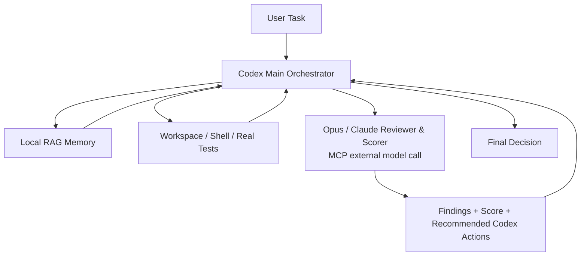

# AI Agent Swarm Lite

<p align="center">
  
</p>

<p align="center">
  <strong>Codex 主控的精简多模型协作插件：Codex 做规划、授权、真实测试和最终决策；Opus/Claude 只做外部审查与评分。</strong>
</p>

<p align="center">
  
  
  <a href="./LICENSE"></a>
  
</p>

## 简介

AI Agent Swarm Lite 是 AI Agent Swarm 的精简分支版本。它去掉了 Gemini tester 工作环节，也不把外部模型设计成复杂的多角色流水线。

Lite 版只保留三个核心：

| 层级 | 职责 |
| --- | --- |
| Codex Main Orchestrator | 规划、授权、真实文件修改、真实测试执行、RAG 写入、最终决策 |
| Opus/Claude Reviewer & Scorer | 对 Codex 的方案、diff 或结果做外部审查、风险判断和 0-100 评分 |
| Local RAG Memory | 沉淀已验证的项目约定、历史 bug、命令、决策和风险 |

默认 Opus/Claude Reviewer & Scorer 不直接写文件、不运行测试、不做最终决定。它只提供审查意见和评分，Codex 决定是否接受。保留的 coder 工具只作为显式授权的兼容能力，不属于 Lite 默认流程。

## 工程闸门

Lite 版从 `1.4.9-lite.1` 开始同步主体版 V1.4.9 的安全发布能力，并继续默认启用工程闸门。非简单任务在正式编码前必须先产出工程设计文档和开发计划，并调用 Opus/Claude 做 `plan-review`。只要返回 blocking findings、must-fix items、`approved_to_continue: false`，或计划分低于 80 且没有充分解释，Codex 必须先修正文档和计划，再次审查。

进入开发后，Codex 按批准计划自动推进。重要实现步骤后做 diff 检查；高风险或非平凡改动调用 `diff-review`。真实测试完成后，把 command、exit code、stdout、stderr 和变更摘要交给 Opus/Claude 做 `test-review`。详见 [docs/ENGINEERING_GATE.md](./docs/ENGINEERING_GATE.md)。

## 文档怎么用

普通用户只需要记住 3 个入口：

| 场景 | 发送给 Codex 的文档 |
| --- | --- |
| 首次安装或更新后检查 | [docs/INSTALL_PROMPT.md](./docs/INSTALL_PROMPT.md) |
| 日常开发、新项目、已有项目接手 | [docs/START_PROMPT.md](./docs/START_PROMPT.md) |
| 维护者打包和同步 GitHub Release | [docs/RELEASE_PROMPT.md](./docs/RELEASE_PROMPT.md) |

完整导航见 [docs/README.md](./docs/README.md)。旧版拆分提示词已移动到 [docs/legacy/](./docs/legacy/)，历史 release note 已移动到 [docs/releases/](./docs/releases/)；普通用户不需要再从这些归档文件里选择。

## 为什么做 Lite 版

完整版 AI Agent Swarm 适合复杂任务：Coder、Tester、Reviewer、Test Runner、RAG Curator 都有明确角色。

Lite 版适合更轻的日常工作流：

- 你希望 Codex 继续作为唯一主控。
- 你不想引入 Gemini 测试策略环节。
- 你希望 Opus/Claude 作为“外部高质量审查员”给方案或 diff 打分。
- 你希望流程更短、更容易解释、更低成本。

## 架构



## MCP 工具

| 工具 | 用途 |
| --- | --- |
| `multi_model_coder_patch` | 可选：让外部 coder 给出补丁建议，不直接写文件 |
| `multi_model_coder_workspace_edit` | 可选：仍保留受控 workspace edit 能力，但 Lite 默认不作为主流程 |
| `multi_model_reviewer_findings` | 让 Opus/Claude 返回审查 findings |
| `multi_model_reviewer_score` | 让 Opus/Claude 对 plan/diff/test/final gate 给出 0-100 评分、must-fix items 和继续建议 |
| `multi_model_role_call` | 调用 custom 或指定外部模型角色 |
| `multi_model_config_status` | 查看角色 provider/model/baseUrl/apiKeyEnv/hasApiKey 状态，不打印 key |
| `multi_model_rag_status` | 查看本地项目记忆库状态 |
| `multi_model_rag_ingest` | 导入 Codex 明确授权读取的本地文件 |
| `multi_model_rag_note` | 写入 Codex 已验证的知识条目 |
| `multi_model_rag_search` | 本地词法检索，不调用外部模型 |
| `multi_model_rag_get` | 按 chunk/document id 获取有限上下文 |

Lite 版不暴露 `multi_model_tester_plan`，默认不使用 Gemini。

## 默认角色配置

| 角色 | Provider | 默认模型 | API Key 环境变量 |
| --- | --- | --- | --- |
| Coder | `anthropic` | `claude-opus-4-8` | `ANTHROPIC_API_KEY` |
| Reviewer / Scorer | `anthropic` | `claude-opus-4-8` | `ANTHROPIC_API_KEY` |
| Custom | `openai-compatible` | 可配置 | `EXTERNAL_MODEL_API_KEY` |

## 推荐工作流

1. Codex 读取需求，制定方案。
2. Codex 检索本地 RAG，只选择必要片段进入上下文。
3. Codex 自己修改文件或运行命令。
4. 非简单任务正式编码前调用 `multi_model_reviewer_score` 做 `plan-review`。
5. 高风险或非平凡 diff 调用 `diff-review`。
6. 真实测试完成后调用 `test-review`。
7. Codex 审查外部意见，运行真实测试，做最终决定。
8. 任务结束后，Codex 将已验证的 bug、命令、决策或风险写入 RAG。

## 配置

复制模板：

```powershell
Copy-Item .env.example .env
```

`*_API_KEY_ENV` 字段应填写环境变量名，不是密钥值本身：

```text
MMA_REVIEWER_API_KEY_ENV=ANTHROPIC_API_KEY
ANTHROPIC_API_KEY=这里才是本地真实 key
```

## 本地自检

```powershell
node scripts/mcp-smoke-test.mjs
node scripts/http-retry-self-test.mjs
node scripts/model-secret-self-test.mjs
node scripts/rag-self-test.mjs
node scripts/rag-metadata-self-test.mjs
node scripts/rag-security-self-test.mjs
node scripts/rag-text-self-test.mjs
node scripts/workspace-edit-json-self-test.mjs
node scripts/workspace-edit-repair-self-test.mjs
node scripts/reviewer-score-self-test.mjs
```

真实外部模型连通性测试：

```powershell
node scripts/api-smoke-test.mjs
```

## 打包发布

生成 Lite 发布包：

```powershell
node scripts/package-release.mjs C:\path\to\outputs
```

同步 GitHub Release 和 zip asset：

```powershell
node scripts/sync-github-release.mjs C:\path\to\outputs
```

GitHub Release token 只从环境变量或用户级凭据文件读取：

1. `GITHUB_TOKEN` 或 `GH_TOKEN`。
2. `MMA_GITHUB_TOKEN_FILE` 指定的用户级 token 文件。
3. `$CODEX_HOME\multi-model-agents\github-release-token`，如果设置了 `CODEX_HOME`。
4. `%USERPROFILE%\.codex\multi-model-agents\github-release-token`。
5. `%TEMP%\github_release_token.txt` 兼容旧临时文件。

不要把 GitHub token 放进插件仓库、`.env`、`.env.example`、README、发布包、RAG、issue、PR、截图或聊天记录。如果 token 曾经粘贴到聊天或日志中，必须撤销并重新创建。

## 联系方式

- 开发者：Su94
- 邮箱：601107432@qq.com
- 联系电话：17623311332
- GitHub：[su94-X/AI-Agent-Swarm](https://github.com/su94-X/AI-Agent-Swarm)

## License

This project is licensed under the Apache License 2.0. See [LICENSE](./LICENSE) for details.
